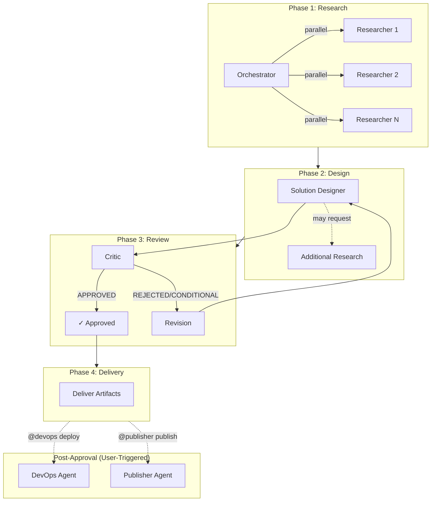

# Copilot Agents

Reusable GitHub Copilot chat agents for technical solution design, documentation, and cloud deployment workflows (currently supports AWS and Terraform).

## Agents

| Agent | Role | Subagents | Key Capabilities |
|-------|------|-----------|------------------|
| **orchestrator** | Workflow Manager | researcher, solution-designer, critic | Coordinates multi-agent workflows, manages iterations (max 5), prevents loops, delivers final artifacts |
| **researcher** | Research Specialist | — | Web research via Tavily MCP, technical documentation discovery, source-backed findings |
| **solution-designer** | Solution Architect | researcher, critic | Creates Solution Design documents, technical architecture, extended thinking for complex decisions |
| **critic** | Technical Reviewer | — | Reviews designs, structured feedback with severity levels, APPROVED/CONDITIONAL/REJECTED verdicts |
| **devops** | DevOps Engineer | critic | Infrastructure as Code generation from approved designs, deployment execution, verification procedures |
| **publisher** | Publications Specialist | — | Mermaid to PNG conversion, Confluence page creation via Atlassian MCP |

### Agent Configuration

Each agent's settings (model, tools, capabilities) can be customized by editing the corresponding `.agent.md` file in the `agents/` directory. The YAML frontmatter contains:
- `model`: AI model to use (e.g., Claude Sonnet 4.5, Claude Opus 4.6)
- `tools`: Available tools for the agent
- `agents`: Subagents this agent can invoke

Example frontmatter:
```yaml
---
name: Orchestrator
description: Multi-agent workflow orchestrator
model: Claude Sonnet 4.5 (copilot)
tools: ['read_file', 'create_file', 'agent']
agents: ['researcher', 'solution-designer', 'critic']
---
```

## Typical Workflow



## Installation

### Option 1: Git Submodule (Recommended)

```bash
git submodule add git@github.com:YOUR-ORG/copilot-agents.git .github/copilot-agents

ln -s copilot-agents/agents .github/agents
ln -s copilot-agents/instructions .github/instructions
ln -s copilot-agents/skills .github/skills
```

### Option 2: Direct Clone

```bash
git clone git@github.com:YOUR-ORG/copilot-agents.git .github
```

### Option 3: Copy Files

```bash
cp -r copilot-agents/agents .github/
cp -r copilot-agents/instructions .github/
cp -r copilot-agents/skills .github/
```

## Usage

```
@orchestrator create solution design for distributed TTS service
@researcher research autoscaling best practices
@devops deploy the approved solution
@publisher publish document to Confluence
```

## Project Structure

```
copilot-agents/
├── agents/              # Agent definitions (.agent.md)
├── instructions/        # Detailed instructions per agent
│   ├── orchestrator/
│   ├── solution-designer/
│   ├── critic/
│   ├── devops/
│   ├── publisher/
│   └── shared/
├── skills/              # Reusable skills with scripts
│   ├── devops/
│   ├── workflow-logger/
│   ├── workflow-state-manager/
│   └── iteration-controller/
└── README.md
```

## Configuration

Add project context in `.github/copilot-instructions.md`:

```markdown
# Project Context
[Your project description and naming conventions]
```

## Updating

```bash
git submodule update --remote .github/copilot-agents
```

## License

MIT
